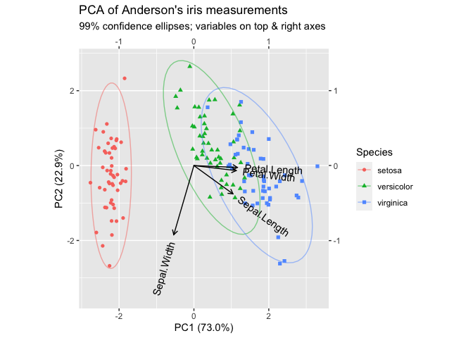

<!-- edit README.rmd -->

[](https://travis-ci.org/corybrunson/ordr)

# ordr

**ordr** integrates ordination analysis and biplot visualization into
[**tidyverse**](https://github.com/tidyverse/tidyverse) workflows.

## motivation

### ordination and biplots

*Ordination* is a catch-all term for a variety of statistical techniques
that introduce an artificial coordinate system for a data set in such a
way that a few coordinates capture a large amount of the data structure
[1]. The branch of mathematical statistics called [geometric data
analysis](https://www.springer.com/us/book/9781402022357) (GDA) provides
the theoretical basis for (most of) these techniques. Ordination
overlaps with regression and with dimension reduction, which can be
[contrasted to clustering and
classification](https://towardsdatascience.com/supervised-vs-unsupervised-learning-14f68e32ea8d)
in that they assign continuous rather than discrete values to data
elements [2].

Most ordination techniques decompose a numeric rectangular data set into
the product of two matrices, often using singular value decomposition.
The coordinates of the shared dimensions of these matrices (over which
they are multiplied) are the artificial coordinates. In some cases, such
as principal components analysis, the decomposition is exact; in others,
such as non-negative matrix factorization, it is approximate. Some
techniques, such as correspondence analysis, transform the data before
decomposition. Ordination techniques may be supervised, like linear
discriminant analysis, or unsupervised, like multidimensional scaling.

Analysis pipelines that use these techniques may use the artificial
coordinates directly, in place of natural coordinates, to arrange and
compare data elements or to predict responses. This is possible because
both the rows and the columns of the original table can be located, or
positioned, along these shared coordinates. The number of artificial
coordinates used in an application, such as regression or visualization,
is called the *rank* of the ordination [3]. A common application is the
*biplot*, which positions the rows and columns of the original table in
a scatterplot in 1, 2, or 3 artificial coordinates, usually those that
explain the most variation in the data.

### implementations in R

An extensive range of ordination techniques are implemented in R, from
classical multidimensional scaling (`stats::cmdscale()`) and principal
components analysis (`stats::prcomp()` and `stats::princomp()`) in the
**stats** package distributed with base R, across widely-used
implementations of linear discriminant analysis (`MASS::lda()`) and
correspondence analysis (`ca::ca()`) in general-use statistical
packages, to highly specialized packages that implement cutting-edge
techniques or adapt conventional techniques to challenging settings.
These implementations come with their own conventions, tailored to the
research communities that produced them, and it would be impractical
(and probably unhelpful) to try to consolidate them.

Instead, **ordr** provides a streamlined process by which the models
output by these methods—in particular, the matrix factors into which the
original data are approximately decomposed and the artificial
coordinates they share—can be inspected, annotated, tabulated,
summarized, and visualized. On this last point, most biplot
implementations in R provide limited customizability. **ordr** adopts
the grammar of graphics paradigm from **ggplot2** to modularize and
standardize biplot elements [4]. Overall, the package is designed to
follow the broader syntactic conventions of the **tidyverse**, so that
users familiar with a this workflow can more easily and quickly
integrate ordination models into practice.

## usage

### installation

**ordr** remains under development and is not scheduled for a CRAN
release. For now, it can be installed from the (default) `main` branch
using [**remotes**](https://github.com/r-lib/remotes):

``` r
remotes::install_github("corybrunson/ordr")
```

### example

A very common illustration of ordination in R uses Anderson’s iris
measurements, consisting of lengths and widths of the petals and
surrounding sepals from 50 each of three species of iris:

``` r
head(iris)
#>   Sepal.Length Sepal.Width Petal.Length Petal.Width Species
#> 1          5.1         3.5          1.4         0.2  setosa
#> 2          4.9         3.0          1.4         0.2  setosa
#> 3          4.7         3.2          1.3         0.2  setosa
#> 4          4.6         3.1          1.5         0.2  setosa
#> 5          5.0         3.6          1.4         0.2  setosa
#> 6          5.4         3.9          1.7         0.4  setosa
summary(iris)
#>   Sepal.Length    Sepal.Width     Petal.Length    Petal.Width   
#>  Min.   :4.300   Min.   :2.000   Min.   :1.000   Min.   :0.100  
#>  1st Qu.:5.100   1st Qu.:2.800   1st Qu.:1.600   1st Qu.:0.300  
#>  Median :5.800   Median :3.000   Median :4.350   Median :1.300  
#>  Mean   :5.843   Mean   :3.057   Mean   :3.758   Mean   :1.199  
#>  3rd Qu.:6.400   3rd Qu.:3.300   3rd Qu.:5.100   3rd Qu.:1.800  
#>  Max.   :7.900   Max.   :4.400   Max.   :6.900   Max.   :2.500  
#>        Species  
#>  setosa    :50  
#>  versicolor:50  
#>  virginica :50  
#>                 
#>                 
#> 
```

An unsupervised ordination approach to these data is principal
components analysis (PCA). Because a flower’s sepals tend to be larger
than its petals (and their lengths greater than their widths), the
measurements should be scaled as well as centered before the PCA:

``` r
(iris_pca <- prcomp(iris[, 1:4], scale. = TRUE))
#> Standard deviations (1, .., p=4):
#> [1] 1.7083611 0.9560494 0.3830886 0.1439265
#> 
#> Rotation (n x k) = (4 x 4):
#>                     PC1         PC2        PC3        PC4
#> Sepal.Length  0.5210659 -0.37741762  0.7195664  0.2612863
#> Sepal.Width  -0.2693474 -0.92329566 -0.2443818 -0.1235096
#> Petal.Length  0.5804131 -0.02449161 -0.1421264 -0.8014492
#> Petal.Width   0.5648565 -0.06694199 -0.6342727  0.5235971
```

**ordr** provides a new class, ‘tbl\_ord’, that wraps ordination objects
like those of ‘prcomp’ without directly modifying them. The original
model can be recovered with `un_tbl_ord()`.

``` r
(iris_pca <- as_tbl_ord(iris_pca))
#> # A tbl_ord of class 'prcomp': (150 x 4) x (4 x 4)'
#> # 4 coordinates: PC1, PC2, ..., PC4
#> # 
#> # Rows (principal): [ 150 x 4 | 0 ]
#>     PC1    PC2     PC3 ... | 
#>                            | 
#> 1 -2.26 -0.478  0.127      | 
#> 2 -2.07  0.672  0.234  ... | 
#> 3 -2.36  0.341 -0.0441     | 
#> 4 -2.29  0.595 -0.0910     | 
#> 5 -2.38 -0.645 -0.0157     | 
#> 
#> # 
#> # Columns (standard): [ 4 x 4 | 0 ]
#>      PC1     PC2    PC3 ... | 
#>                             | 
#> 1  0.521 -0.377   0.720     | 
#> 2 -0.269 -0.923  -0.244 ... | 
#> 3  0.580 -0.0245 -0.142     | 
#> 4  0.565 -0.0669 -0.634     |
```

The `print()` method for ‘tbl\_ord’ is based on that of tibbles. Like
that for **tidygraph**’s ‘tbl\_graph’, it prints two tibbles, one for
each matrix factor (in PCA, the case scores and the variable loadings of
the original data matrix). The header reminds us of the dimensions of
the matrix factors and how the inertia is distributed (in PCA, with the
scores in principal coordinates and the loadings in standard
coordinates).

Analogous to `broom::augment()`, this tbl\_ord-specific function
preserves the class but augments the row and column tibbles with any
metadata or diagnostics contained in the model object. Vertical bars
separate the coordinate matrices from other columns.

``` r
(iris_pca <- augment_ord(iris_pca))
#> # A tbl_ord of class 'prcomp': (150 x 4) x (4 x 4)'
#> # 4 coordinates: PC1, PC2, ..., PC4
#> # 
#> # Rows (principal): [ 150 x 4 | 0 ]
#>     PC1    PC2     PC3 ... | 
#>                            | 
#> 1 -2.26 -0.478  0.127      | 
#> 2 -2.07  0.672  0.234  ... | 
#> 3 -2.36  0.341 -0.0441     | 
#> 4 -2.29  0.595 -0.0910     | 
#> 5 -2.38 -0.645 -0.0157     | 
#> 
#> # 
#> # Columns (standard): [ 4 x 4 | 3 ]
#>      PC1     PC2    PC3 ... |   .name        .center .scale
#>                             |   <chr>          <dbl>  <dbl>
#> 1  0.521 -0.377   0.720     | 1 Sepal.Length    5.84  0.828
#> 2 -0.269 -0.923  -0.244 ... | 2 Sepal.Width     3.06  0.436
#> 3  0.580 -0.0245 -0.142     | 3 Petal.Length    3.76  1.77 
#> 4  0.565 -0.0669 -0.634     | 4 Petal.Width     1.20  0.762
```

Additional row- and column-level variables can be augmented and
manipulated using a handful of **dplyr**-like verbs, each specific to
the matrix factor being affected (`rows` or `cols`):

``` r
(iris_pca <- mutate_rows(iris_pca, Species = iris$Species))
#> # A tbl_ord of class 'prcomp': (150 x 4) x (4 x 4)'
#> # 4 coordinates: PC1, PC2, ..., PC4
#> # 
#> # Rows (principal): [ 150 x 4 | 1 ]
#>     PC1    PC2     PC3 ... |   Species
#>                            |   <fct>  
#> 1 -2.26 -0.478  0.127      | 1 setosa 
#> 2 -2.07  0.672  0.234  ... | 2 setosa 
#> 3 -2.36  0.341 -0.0441     | 3 setosa 
#> 4 -2.29  0.595 -0.0910     | 4 setosa 
#> 5 -2.38 -0.645 -0.0157     | 5 setosa 
#> # … with 145 more rows
#> # 
#> # Columns (standard): [ 4 x 4 | 3 ]
#>      PC1     PC2    PC3 ... |   .name        .center .scale
#>                             |   <chr>          <dbl>  <dbl>
#> 1  0.521 -0.377   0.720     | 1 Sepal.Length    5.84  0.828
#> 2 -0.269 -0.923  -0.244 ... | 2 Sepal.Width     3.06  0.436
#> 3  0.580 -0.0245 -0.142     | 3 Petal.Length    3.76  1.77 
#> 4  0.565 -0.0669 -0.634     | 4 Petal.Width     1.20  0.762
```

Because the above steps are so common when fitting ordination models to
data frames, a convenience function is available to expedite them:

``` r
ordinate(iris, cols = 1:4, model = ~ prcomp(., scale. = TRUE))
#> # A tbl_ord of class 'prcomp': (150 x 4) x (4 x 4)'
#> # 4 coordinates: PC1, PC2, ..., PC4
#> # 
#> # Rows (principal): [ 150 x 4 | 1 ]
#>     PC1    PC2     PC3 ... |   Species
#>                            |   <fct>  
#> 1 -2.26 -0.478  0.127      | 1 setosa 
#> 2 -2.07  0.672  0.234  ... | 2 setosa 
#> 3 -2.36  0.341 -0.0441     | 3 setosa 
#> 4 -2.29  0.595 -0.0910     | 4 setosa 
#> 5 -2.38 -0.645 -0.0157     | 5 setosa 
#> # … with 145 more rows
#> # 
#> # Columns (standard): [ 4 x 4 | 3 ]
#>      PC1     PC2    PC3 ... |   .name        .center .scale
#>                             |   <chr>          <dbl>  <dbl>
#> 1  0.521 -0.377   0.720     | 1 Sepal.Length    5.84  0.828
#> 2 -0.269 -0.923  -0.244 ... | 2 Sepal.Width     3.06  0.436
#> 3  0.580 -0.0245 -0.142     | 3 Petal.Length    3.76  1.77 
#> 4  0.565 -0.0669 -0.634     | 4 Petal.Width     1.20  0.762
```

Following `broom::tidy()`, this tidier for tbl\_ords returns a tibble
with one row per artificial coordinate (in this case, principal
coordinate):[5]

``` r
tidy(iris_pca)
#> # A tibble: 4 x 4
#>   .name .sdev .inertia .prop_var
#>   <fct> <dbl>    <dbl>     <dbl>
#> 1 PC1   1.71    435.     0.730  
#> 2 PC2   0.956   136.     0.229  
#> 3 PC3   0.383    21.9    0.0367 
#> 4 PC4   0.144     3.09   0.00518
```

The `.inertia` and `.prop_var` fields are calculated from the singular
values or eigenvalues contained in the ordination object. This means
that `tidy()` prepares any ordination object derived from such a
decomposition for a scree plot using `ggplot2::ggplot()`:

``` r
ggplot(tidy(iris_pca), aes(x = .name, y = .prop_var)) +
  geom_col() +
  labs(x = "", y = "Proportion of inertia") +
  ggtitle("PCA of Anderson's iris measurements",
          "Distribution of inertia")
```

<!-- -->

Following `ggplot2::fortify()`, this fortifier combines the matrix
factor tibbles into a single tibble with an additional `.matrix` column:

``` r
head(fortify(iris_pca))
#> # A tibble: 6 x 9
#>     PC1    PC2     PC3      PC4 Species .matrix .name .center .scale
#>   <dbl>  <dbl>   <dbl>    <dbl> <fct>   <chr>   <chr>   <dbl>  <dbl>
#> 1 -2.26 -0.478  0.127   0.0241  setosa  rows    <NA>       NA     NA
#> 2 -2.07  0.672  0.234   0.103   setosa  rows    <NA>       NA     NA
#> 3 -2.36  0.341 -0.0441  0.0283  setosa  rows    <NA>       NA     NA
#> 4 -2.29  0.595 -0.0910 -0.0657  setosa  rows    <NA>       NA     NA
#> 5 -2.38 -0.645 -0.0157 -0.0358  setosa  rows    <NA>       NA     NA
#> 6 -2.07 -1.48  -0.0269  0.00659 setosa  rows    <NA>       NA     NA
tail(fortify(iris_pca))
#> # A tibble: 6 x 9
#>      PC1     PC2    PC3     PC4 Species   .matrix .name        .center .scale
#>    <dbl>   <dbl>  <dbl>   <dbl> <fct>     <chr>   <chr>          <dbl>  <dbl>
#> 1  1.37  -1.01   -0.930  0.0260 virginica rows    <NA>           NA    NA    
#> 2  0.957  0.0243 -0.526 -0.163  virginica rows    <NA>           NA    NA    
#> 3  0.521 -0.377   0.720  0.261  <NA>      cols    Sepal.Length    5.84  0.828
#> 4 -0.269 -0.923  -0.244 -0.124  <NA>      cols    Sepal.Width     3.06  0.436
#> 5  0.580 -0.0245 -0.142 -0.801  <NA>      cols    Petal.Length    3.76  1.77 
#> 6  0.565 -0.0669 -0.634  0.524  <NA>      cols    Petal.Width     1.20  0.762
```

The `.matrix` column is used by the row- and column-specific parts of a
*dual* layered grammar of graphics that yields a biplot:

``` r
ggbiplot(iris_pca, sec.axes = "cols", scale.factor = 2) +
  geom_rows_point(aes(color = Species, shape = Species)) +
  stat_rows_ellipse(aes(color = Species), alpha = .5, level = .99) +
  geom_cols_vector() +
  geom_cols_text_radiate(aes(label = .name)) +
  expand_limits(y = c(-3.5, NA)) +
  ggtitle("PCA of Anderson's iris measurements",
          "99% confidence ellipses; variables on top & right axes")
```

<!-- -->

Note several conveniences: The position aesthetics are assumed to be the
first and second artifical coordinates, unless otherwise specified; by
default, the aspect ratio is set to 1; and an optional secondary
secondary can be specified for either matrix factor and marked along the
top and right borders of the plotting window.[6]

## acknowledgments

### contribute

Any feedback on the package is very welcome! If you encounter confusion
or errors, do create an issue, with a [minimal reproducible
example](https://stackoverflow.com/help/minimal-reproducible-example) if
feasible. If you have requests, suggestions, or your own implementations
for new features, feel free to create an issue or submit a pull request.
Methods for additional ordination classes (see the `methods-*.r` scripts
in the `R` folder) are especially welcome, as are new plot layers.
Please try to follow the [contributing
guidelines](https://github.com/corybrunson/ordr/blob/main/CONTRIBUTING.md)
and respect the [Code of
Conduct](https://github.com/corybrunson/ordr/blob/main/CODE_OF_CONDUCT.md).

### inspiration

This package was originally inspired by the **ggbiplot** extension
developed by [Vincent Q. Vu](https://github.com/vqv/ggbiplot), [Richard
J Telford](https://github.com/richardjtelford/ggbiplot), and [Vilmantas
Gegzna](https://github.com/GegznaV/ggbiplot), among others. So far as i
know, it first brought biplots into the **tidyverse** framework. The
motivation to unify a variety of ordination methods came from [several
books and
articles](https://www.barcelonagse.eu/research/publications/all?author=Michael%20Greenacre)
by Michael Greenacre, in particular [*Biplots in
Practice*](https://www.fbbva.es/microsite/multivariate-statistics/resources.html#biplots).
Thomas Lin Pedersen’s
[**tidygraph**](https://github.com/thomasp85/tidygraph) prequel to
**ggraph** finally induced the shift from the downstream generation of
scatterplots to the upstream handling and manipulating of ordination
models. Additional design elements and features have been informed by
the monograph
[*Biplots*](https://www.routledge.com/Biplots/Gower-Hand/p/book/9780412716300)
and the textbook [*Understanding
Biplots*](https://www.wiley.com/en-us/Understanding+Biplots-p-9780470012550)
by John C. Gower, David J. Hand, Sugnet Gardner Lubbe, and Niel J. Le
Roux.

### notes

[1] The term *ordination* is most prevalent among ecologists; to my
knowledge, no catch-all term is in common use outside ecology.

[2] This is not a hard rule: PCA is often used to compress data before
clustering, and LDA uses dimension reduction to perform classification
tasks.

[3] Regression and clustering models, like classical [linear
regression](http://www.multivariatestatistics.org/chapter2.html) and
[*k*-means](http://joelcadwell.blogspot.com/2015/08/matrix-factorization-comes-in-many.html),
can also be understood as matrix decomposition approximations and even
visualized in biplots. Their shared coordinates, which are pre-defined
rather than artificial, are the predictor coefficients and the cluster
assignments, respectively. Methods for `stats::lm()` and
`stats::kmeans()`, for example, are implemented for the sake of novelty
and instruction, but are not widely used in practice.

[4] Biplot elments must be chosen with care, and it is useful and
appropriate that many model-specific biplot methods have limited
flexibility. This package adopts the trade-off articulated in
[Wilkinson’s *The Grammar of
Graphics*](https://www.google.com/books/edition/_/iI1kcgAACAAJ) (p. 15):
“This system is capable of producing some hideous graphics. There is
nothing in its design to prevent its misuse. … This system cannot
produce a meaningless graphic, however.”

[5] Note that `ordr::tidy()` takes precedence for ‘tbl\_ord’ objects
because the ‘tbl\_ord’ class precedes the underlying model class.

[6] The radiating text geom, like other parts of the package, are
adapted from the **ggbiplot** package.
