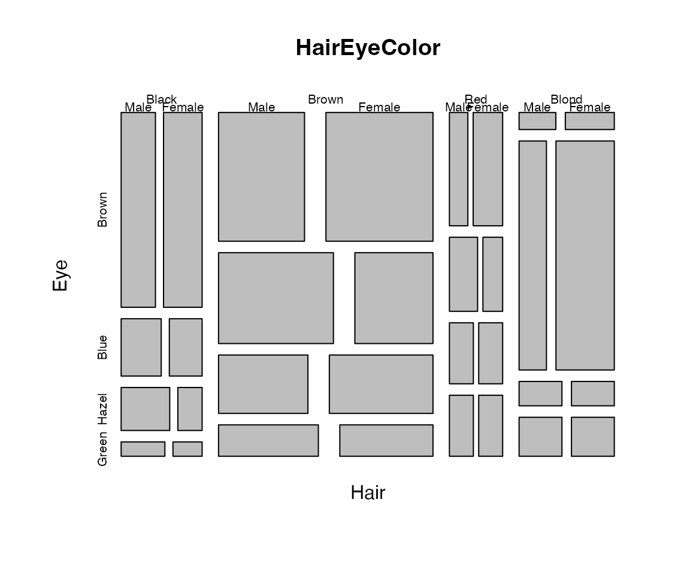
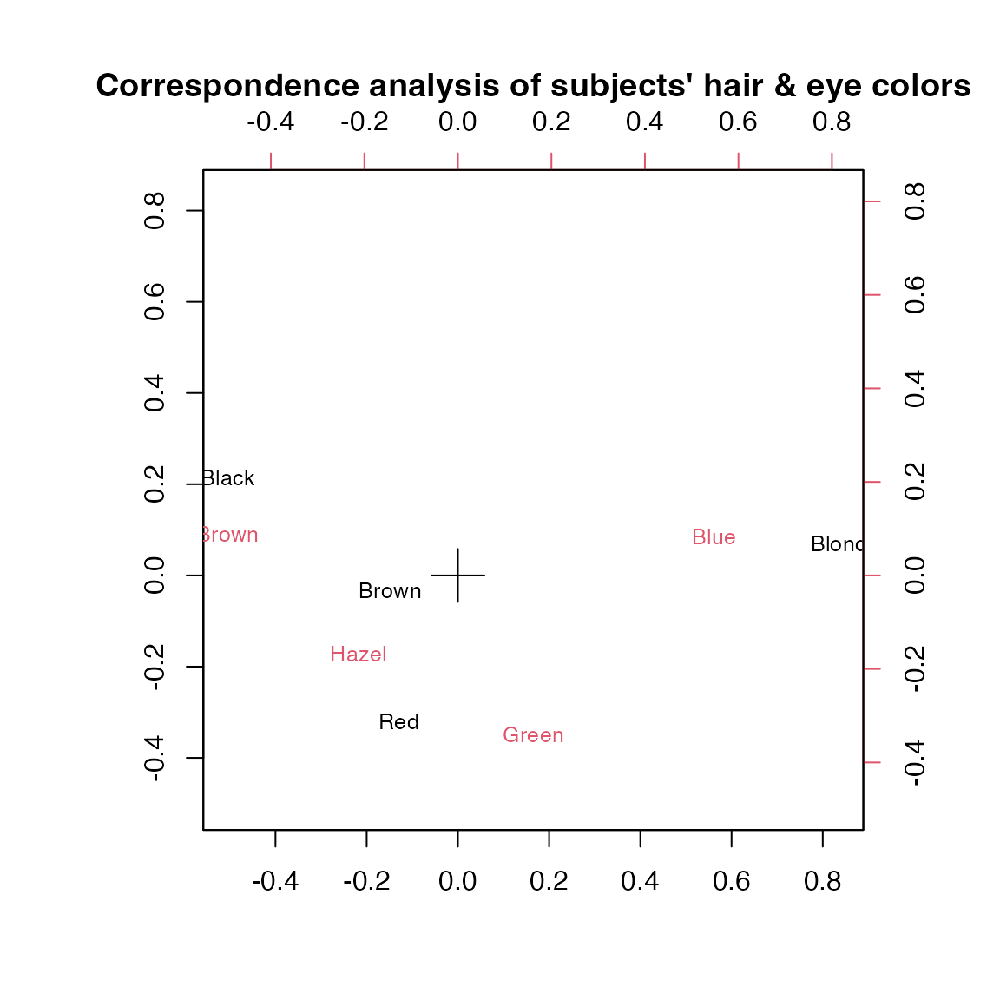
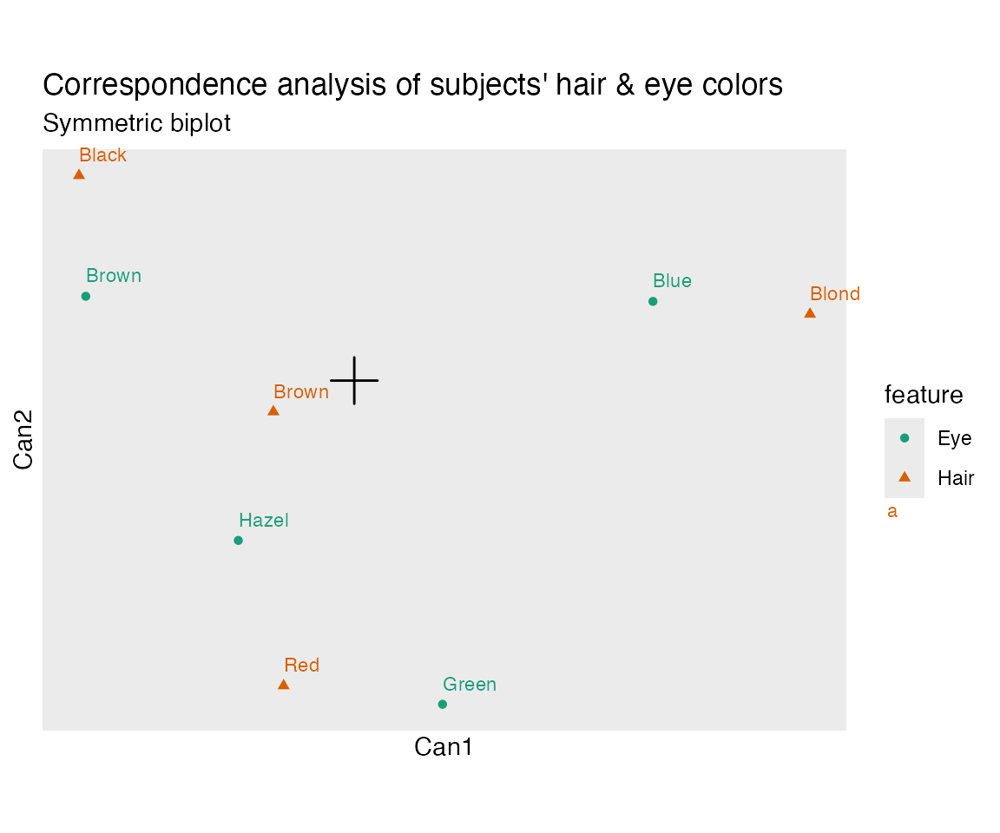

# Ordination in the tidyverse

This vignette introduces the goals and functionality of the **ordr**
package. Users should have some familiarity with the class of
*ordination* models powered by singular value decomposition, such as
principal components analysis, correspondence analysis, and linear
discriminant analysis, and with the *biplot* statistical graphic used to
visualize these models. Users should also be familiar with the
**tidyverse** R package collection for data science and parts of the
**tidymodels** collection for statistical modeling, most notably
**tibble**, **dplyr**, **broom**, and **ggplot2**.

Briefly, **ordr** incorporates ordination models into a “tidy” workflow.
Specifically, for fitted ordination models of a variety of classes,
users can

- augment the model with row- or column-level diagnostics and
  annotations,
- summarize the model or its components as tidy data frames, and
- produce biplots of the model using a layered grammar of graphics.

As an example, this vignette performs a correspondence analysis (CA) of
the `HairEyeColor` data set installed with R, using the fitting engine
[`corresp()`](https://rdrr.io/pkg/MASS/man/corresp.html) provided by the
**MASS** package and its base plotting methods, then showcases the more
flexible and elegant methods provided by **ordr**. While some techniques
specific to CA are not as natural in **ordr**, most can be reproduced
through the principled use of general steps.

``` r

data(HairEyeColor)
library(MASS)
library(ordr)
#> Loading required package: ggplot2
```

## the hair and eye color data

We begin with an inspection of the data using base R. For more
information about the data set, call
[`help(HairEyeColor)`](https://rdrr.io/r/datasets/HairEyeColor.html).

``` r

print(HairEyeColor)
#> , , Sex = Male
#> 
#>        Eye
#> Hair    Brown Blue Hazel Green
#>   Black    32   11    10     3
#>   Brown    53   50    25    15
#>   Red      10   10     7     7
#>   Blond     3   30     5     8
#> 
#> , , Sex = Female
#> 
#>        Eye
#> Hair    Brown Blue Hazel Green
#>   Black    36    9     5     2
#>   Brown    66   34    29    14
#>   Red      16    7     7     7
#>   Blond     4   64     5     8
plot(HairEyeColor)
```



The data were collected by students in one of Ronald Snee’s statistics
courses.[^1] They consist of the hair color and eye color, each binned
into four groups, of 592 subjects. The data are also stratified by sex,
forming a 3-way array. The (default) mosaic plot reveals only subtle
differences by sex, so we lose little by flattening the array into a \\4
\times 4\\ matrix. The resulting count table is suitable for
correspondence analysis, and we fit this model next.

## correspondence analysis using **MASS**

The implementation
[`MASS::corresp()`](https://rdrr.io/pkg/MASS/man/corresp.html) returns
an object of class ‘correspondence’. In addition to the information
included in its [`print()`](https://rdrr.io/r/base/print.html) method,
we can use the canonical correlations to calculate the proportion of
variance along each dimension:

``` r

haireye <- apply(HairEyeColor, c(1L, 2L), sum)
haireye_ca <- corresp(haireye, nf = 3L)
print(haireye_ca)
#> First canonical correlation(s): 0.45691646 0.14908593 0.05097489 
#> 
#>  Hair scores:
#>             [,1]       [,2]       [,3]
#> Black -1.1042772  1.4409170 -1.0889497
#> Brown -0.3244635 -0.2191109  0.9574152
#> Red   -0.2834725 -2.1440145 -1.6312184
#> Blond  1.8282287  0.4667063 -0.3180920
#> 
#>  Eye scores:
#>             [,1]       [,2]        [,3]
#> Brown -1.0771283  0.5924202 -0.42395984
#> Blue   1.1980612  0.5564193  0.09238682
#> Hazel -0.4652862 -1.1227826  1.97191769
#> Green  0.3540108 -2.2741218 -1.71844295
# proportion of variance in each dimension
haireye_ca$cor^2 / sum(haireye_ca$cor^2)
#> [1] 0.89372732 0.09514911 0.01112356
```

The variation in the table, in terms of the \\\chi^2\\ distances between
the distributions of hair color among people with the same eye color
(or, equivalently, vice-versa), lies largely (\\89\\\\) along a single
dimension, with the remaining variation largely (\\9.5\\\\) along a
single orthogonal dimension. The first dimension best distinguishes
between subjects with black hair and brown eyes from those with blond
hair and blue eyes. Subjects with brown and red hair, or with hazel and
green eyes, lie between these extremes.

The second dimension distinguishes subjects with black or blond hair,
and with brown or blue eyes, from those with brown or red hair, and with
hazel or green eyes. Subjects with red hair and green eyes are
especially distinguished along this dimension. This disrupts the
impression from the first dimension alone that subjects lie along a
spectrum from black hair–brown eyes to blond hair–blue eyes, which may
accurately include an intermediate phenotype (brown hair–hazel eyes),
and reveals a phenotype (red hair–green eyes) that diverges from this
spectrum.

As an exercise, we can recover the row and column standard coordinates
returned by [`corresp()`](https://rdrr.io/pkg/MASS/man/corresp.html)
from direct computations, e.g. following [the Wikipedia article on
correspondence
analysis](https://en.wikipedia.org/wiki/Correspondence_analysis),
starting from the data matrix (count table) \\X\\ with total count \\n =
1^\top X 1\\:

1.  The *correspondence matrix* (the matrix of relative frequencies) \\P
    = \frac{1}{n} X\\
2.  The row and column weights \\r = \frac{1}{n} X 1\\ and \\c =
    \frac{1}{n} 1^\top X\\
3.  The diagonals of inverse weights \\D_r = \operatorname{diag}(r)\\
    and \\D_c = \operatorname{diag}(c)\\
4.  The matrix of *standardized residuals* \\S = D_r (P - rc) D_c\\
5.  The singular value decomposition \\S = U \Sigma V^\top\\
6.  The row and column standard coordinates \\F = D_r U\\ and \\G = D_c
    V\\

``` r

# correspondence matrix (matrix of relative frequencies)
(haireye_p <- haireye / sum(haireye))
#>        Eye
#> Hair         Brown       Blue      Hazel       Green
#>   Black 0.11486486 0.03378378 0.02533784 0.008445946
#>   Brown 0.20101351 0.14189189 0.09121622 0.048986486
#>   Red   0.04391892 0.02871622 0.02364865 0.023648649
#>   Blond 0.01182432 0.15878378 0.01689189 0.027027027
# row and column weights
(haireye_r <- rowSums(haireye) / sum(haireye))
#>     Black     Brown       Red     Blond 
#> 0.1824324 0.4831081 0.1199324 0.2145270
(haireye_c <- colSums(haireye) / sum(haireye))
#>     Brown      Blue     Hazel     Green 
#> 0.3716216 0.3631757 0.1570946 0.1081081
# matrix of standardized residuals
(haireye_s <-
    diag(1 / sqrt(haireye_r)) %*%
    (haireye_p - haireye_r %*% t(haireye_c)) %*%
    diag(1 / sqrt(haireye_c)))
#>              [,1]        [,2]        [,3]        [,4]
#> [1,]  0.180773066 -0.12615064 -0.01961905 -0.08029590
#> [2,]  0.050694815 -0.08012300  0.05561963 -0.01418351
#> [3,] -0.003081574 -0.07110772  0.03502737  0.09381990
#> [4,] -0.240474512  0.28973637 -0.09156384  0.02518174
# singular value decomposition
haireye_svd <- svd(haireye_s)
# row and column standard coordinates
diag(1 / sqrt(haireye_r)) %*% haireye_svd$u[, 1:3]
#>            [,1]       [,2]       [,3]
#> [1,] -1.1042772  1.4409170 -1.0889497
#> [2,] -0.3244635 -0.2191109  0.9574152
#> [3,] -0.2834725 -2.1440145 -1.6312184
#> [4,]  1.8282287  0.4667063 -0.3180920
diag(1 / sqrt(haireye_c)) %*% haireye_svd$v[, 1:3]
#>            [,1]       [,2]        [,3]
#> [1,] -1.0771283  0.5924202 -0.42395984
#> [2,]  1.1980612  0.5564193  0.09238682
#> [3,] -0.4652862 -1.1227826  1.97191769
#> [4,]  0.3540108 -2.2741218 -1.71844295
```

We can generate a biplot display via the
[`biplot()`](https://rdrr.io/r/stats/biplot.html) method for the
‘correspondence’ class, also provided by **MASS**:

``` r

biplot(
  haireye_ca, type = "symmetric", cex = .8,
  main = "Correspondence analysis of subjects' hair & eye colors"
)
```



This *symmetric biplot* evenly distributes the inertia between the rows
and columns. Distances between points in the same matrix factor do not
approximate their \\\chi^2\\ distances, but inner products between row
and column points approximate their standardized residuals. The row and
column profile markers are resized to represent the masses of the
groups.

## **ordr** methods for CA models

**ordr** provides a new class, ‘tbl_ord’, that wraps ordination objects
like those of class ‘prcomp’ without directly modifying them. (The
original model can be recovered with
[`un_tbl_ord()`](../reference/tbl_ord.md).)

``` r

(haireye_ca_ord <- as_tbl_ord(haireye_ca))
#> # A tbl_ord of class 'correspondence': (4 × 3) · (4 × 3)´
#> # 3 coordinates: Can1, Can2, Can3
#> # Rows (standard, 0%): [ 4 × 3 | 0 ]
#>     Can1   Can2    Can3 | 
#>      [1]    [1]     [1] | 
#> 1 -1.10   1.44  -1.09   | 
#> 2 -0.324 -0.219  0.957  | 
#> 3 -0.283 -2.14  -1.63   | 
#> 4  1.83   0.467 -0.318  | 
#> # Columns (standard, 0%): [ 4 × 3 | 0 ]
#>     Can1   Can2    Can3 | 
#>      [1]    [1]     [1] | 
#> 1 -1.08   0.592 -0.424  | 
#> 2  1.20   0.556  0.0924 | 
#> 3 -0.465 -1.12   1.97   | 
#> 4  0.354 -2.27  -1.72   | 
```

The [`print()`](https://rdrr.io/r/base/print.html) method for ‘tbl_ord’
is based on that of tibbles. It prints two tibbles, like that for the
‘tbl_graph’ class of
[**tidygraph**](https://tidygraph.data-imaginist.com/), one for each
matrix factor.

The header reminds us of the dimensions of the matrix factors and how
the inertia is distributed. In ‘correspondence’ objects, by default both
row and column profiles are in standard coordinates: \\D_r F\\ and \\D_c
G\\, but these can be reassigned to any pair of proportions \\D_r S
{D_c}^\top = (D_r U \Sigma^{p}) (D_c V \Sigma^{q})^\top\\, even if \\p +
q \neq 1\\. By assigning `"symmetric"` inertia, we distribute half of
the inertia to each matrix factor:

``` r

get_conference(haireye_ca_ord)
#> [1] 0 0
confer_inertia(haireye_ca_ord, c(.25, .75))
#> # A tbl_ord of class 'correspondence': (4 × 3) · (4 × 3)´
#> # 3 coordinates: Can1, Can2, Can3
#> # Rows (25% inertia, 25%): [ 4 × 3 | 0 ]
#>     Can1   Can2     Can3 | 
#>  [0.676][0.386] [0.2258] | 
#> 1 -0.908  0.895 -0.517   | 
#> 2 -0.267 -0.136  0.455   | 
#> 3 -0.233 -1.33  -0.775   | 
#> 4  1.50   0.290 -0.151   | 
#> # Columns (75% inertia, 75%): [ 4 × 3 | 0 ]
#>     Can1   Can2     Can3 | 
#> [0.3089][0.058][0.01151] | 
#> 1 -0.599  0.142 -0.0455  | 
#> 2  0.666  0.133  0.00991 | 
#> 3 -0.259 -0.269  0.212   | 
#> 4  0.197 -0.546 -0.184   | 
confer_inertia(haireye_ca_ord, c(1, 1))
#> Warning in confer_inertia(haireye_ca_ord, c(1, 1)): Inertia is not balanced.
#> # A tbl_ord of class 'correspondence': (4 × 3) · (4 × 3)´
#> # 3 coordinates: Can1, Can2, Can3
#> # Rows (principal, 100%): [ 4 × 3 | 0 ]
#>     Can1    Can2     Can3 | 
#> [0.2088][0.0222] [0.0026] | 
#> 1 -0.505  0.215  -0.0555  | 
#> 2 -0.148 -0.0327  0.0488  | 
#> 3 -0.130 -0.320  -0.0832  | 
#> 4  0.835  0.0696 -0.0162  | 
#> # Columns (principal, 100%): [ 4 × 3 | 0 ]
#>     Can1    Can2     Can3 | 
#> [0.2088][0.0222] [0.0026] | 
#> 1 -0.492  0.0883 -0.0216  | 
#> 2  0.547  0.0830  0.00471 | 
#> 3 -0.213 -0.167   0.101   | 
#> 4  0.162 -0.339  -0.0876  | 
(haireye_ca_ord <- confer_inertia(haireye_ca_ord, "symmetric"))
#> # A tbl_ord of class 'correspondence': (4 × 3) · (4 × 3)´
#> # 3 coordinates: Can1, Can2, Can3
#> # Rows (symmetric, 50%): [ 4 × 3 | 0 ]
#>     Can1    Can2    Can3 | 
#> [0.4569][0.1491] [0.051] | 
#> 1 -0.746  0.556  -0.246  | 
#> 2 -0.219 -0.0846  0.216  | 
#> 3 -0.192 -0.828  -0.368  | 
#> 4  1.24   0.180  -0.0718 | 
#> # Columns (symmetric, 50%): [ 4 × 3 | 0 ]
#>     Can1    Can2    Can3 | 
#> [0.4569][0.1491] [0.051] | 
#> 1 -0.728  0.229  -0.0957 | 
#> 2  0.810  0.215   0.0209 | 
#> 3 -0.315 -0.434   0.445  | 
#> 4  0.239 -0.878  -0.388  | 
```

[`broom::glance()`](https://generics.r-lib.org/reference/glance.html)
returns a single-row tibble summary of a model object. It was designed
for analysis pipelines involving multiple models (e.g. model selection),
to facilitate summaries of multiple models at once. ‘tbl_ord’ objects
wrap a potentially huge variety of models, for which only a few summary
statistics will usually be useful. This method includes the rank of the
matrix factorization; the proportion of inertia/variance in the first
two dimensions, which characterize the fidelity of a biplot to the
complete data; and the original object class.

``` r

glance(haireye_ca_ord)
#> # A tibble: 1 × 7
#>    rank n.row n.col inertia prop.var.1 prop.var.2 class         
#>   <int> <int> <int>   <dbl>      <dbl>      <dbl> <chr>         
#> 1     3     4     4   0.234      0.894     0.0951 correspondence
```

Analogous to
[`broom::augment()`](https://generics.r-lib.org/reference/augment.html),
this tbl_ord-specific function preserves the ‘tbl_ord’ class but
augments the row and column tibbles with any metadata or diagnostics
found in the model object. Vertical bars separate the coordinate
matrices from annotations.

``` r

augment_ord(haireye_ca_ord)
#> # A tbl_ord of class 'correspondence': (4 × 3) · (4 × 3)´
#> # 3 coordinates: Can1, Can2, Can3
#> # Rows (symmetric, 50%): [ 4 × 3 | 2 ]
#>     Can1    Can2    Can3 | name  .element
#> [0.4569][0.1491] [0.051] | <chr> <chr>   
#> 1 -0.746  0.556  -0.246  | Black active  
#> 2 -0.219 -0.0846  0.216  | Brown active  
#> 3 -0.192 -0.828  -0.368  | Red   active  
#> 4  1.24   0.180  -0.0718 | Blond active  
#> # Columns (symmetric, 50%): [ 4 × 3 | 2 ]
#>     Can1    Can2    Can3 | name  .element
#> [0.4569][0.1491] [0.051] | <chr> <chr>   
#> 1 -0.728  0.229  -0.0957 | Brown active  
#> 2  0.810  0.215   0.0209 | Blue  active  
#> 3 -0.315 -0.434   0.445  | Hazel active  
#> 4  0.239 -0.878  -0.388  | Green active
```

Additional row- and column-level variables can also be augmented and
manipulated using a handful of **dplyr**-like verbs, each specific to
the matrix factor being affected (`rows` or `cols`). Each tibble is
split between the shared coordinates on the left and any additional
annotation columns on the right.

The [`broom::tidy()`](https://generics.r-lib.org/reference/tidy.html)
method for tbl_ords returns a tibble with one row per artificial
coordinate.[^2] In CA, these are variably called dimensions or
components. The ‘correspondence’ object contains a `$cor` vector of
canonical correlations, which is included in the result; other
coordinate-level attributes vary by model object class.

``` r

tidy(haireye_ca_ord)
#> # A tibble: 3 × 5
#>   name     cor inertia prop_var quality
#>   <fct>  <dbl>   <dbl>    <dbl>   <dbl>
#> 1 Can1  0.457  0.209     0.894    0.894
#> 2 Can2  0.149  0.0222    0.0951   0.989
#> 3 Can3  0.0510 0.00260   0.0111   1
```

The `.inertia` and `.prop_var` fields are calculated from the singular
values or eigenvalues contained in the ordination object and always
appear when defined. This means that
[`tidy()`](https://generics.r-lib.org/reference/tidy.html) prepares any
ordination object derived from such a decomposition for a scree plot
with
[`ggplot2::ggplot()`](https://ggplot2.tidyverse.org/reference/ggplot.html):

``` r

ggplot(tidy(haireye_ca_ord), aes(x = name, y = inertia)) +
  geom_col() +
  labs(x = "Component", y = "Inertia") +
  ggtitle("Correspondence analysis of subjects' hair & eye colors",
          "Decomposition of inertia")
```


While
[`ggplot2::fortify()`](https://ggplot2.tidyverse.org/reference/fortify.html)
may rarely be called directly, is plays a special role in **ordr** by
converting a ‘tbl_ord’ object to a ‘tbl_df’ object. To do this, the
fortifier row-binds the two matrix factor tibbles and adds an additional
`.matrix` column to remember which was which:

``` r

fortify(haireye_ca_ord)
#> # A tibble: 8 × 5
#>     Can1    Can2    Can3 .element .matrix
#>    <dbl>   <dbl>   <dbl> <chr>    <chr>  
#> 1 -0.746  0.556  -0.246  active   rows   
#> 2 -0.219 -0.0846  0.216  active   rows   
#> 3 -0.192 -0.828  -0.368  active   rows   
#> 4  1.24   0.180  -0.0718 active   rows   
#> 5 -0.728  0.229  -0.0957 active   cols   
#> 6  0.810  0.215   0.0209 active   cols   
#> 7 -0.315 -0.434   0.445  active   cols   
#> 8  0.239 -0.878  -0.388  active   cols
```

This fortifier will also preserve any row and column annotations, so it
can be composed with [`augment_ord()`](../reference/augmentation.md) or
with the row- and column-specific verbs. `NA`s are introduced when an
annotation is present for one matrix factor but not the other. (The
`.element` column becomes important when a model produces supplementary
as well as active elements.)

The `.matrix` column also plays a key role in
[`ggbiplot()`](../reference/ggbiplot.md): The row- and column-specific
ploy layers, which take the form `geom_rows_*()` or `stat_cols_*()`, for
example, use this column to subset the data internally. This enables the
layered grammar of graphics of **ggplot2** to apply separately to the
two matrix factors and their annotation. Though note that it can also be
applied to the entire fortified data frame using conventional plot
layers, as below when the `.matrix` column is used to distinguish the
colors and shapes of the row and column profile markers:

``` r

haireye_ca_ord %>%
  augment_ord() %>%
  fortify() %>%
  transform(feature = ifelse(.matrix == "rows", "Hair", "Eye")) %>%
  ggbiplot(aes(color = feature, shape = feature, label = name), clip = "off") +
  theme_biplot() +
  geom_origin() +
  geom_rows_point() +
  geom_cols_point() +
  geom_rows_text(vjust = -1, hjust = 0, size = 3) +
  geom_cols_text(vjust = -1, hjust = 0, size = 3) +
  scale_color_brewer(type = "qual", palette = "Dark2") +
  scale_size_area() +
  ggtitle("Correspondence analysis of subjects' hair & eye colors",
          "Symmetric biplot")
```



Note a few conveniences:

- The position aesthetics are assumed to be the first and second
  artificial coordinates, unless otherwise specified. Biplots can also
  be specified by setting the `x` and `y` aesthetics to integers, which
  are converted to the corresponding artificial coordinates.
- By default, the aspect ratio is set to 1. This is essential for
  biplots, which rely on distances between markers and angles between
  vectors to convey information.
- The partial theme [`theme_biplot()`](../reference/theme_scaffold.md)
  removes several plot elements that are usually not important to
  biplots, most notably gridlines, while retaining other properties of
  the current theme.
- The layer [`geom_origin()`](../reference/geom_origin.md) is one of two
  shortcuts for plotting elements commonly used in biplots, the other
  being [`geom_unit_circle()`](../reference/geom_origin.md).

## session info

``` r

sessioninfo::session_info()
#> ─ Session info ───────────────────────────────────────────────────────────────
#>  setting  value
#>  version  R version 4.5.3 (2026-03-11)
#>  os       macOS Tahoe 26.5.2
#>  system   aarch64, darwin20
#>  ui       X11
#>  language en
#>  collate  en_US.UTF-8
#>  ctype    en_US.UTF-8
#>  tz       America/New_York
#>  date     2026-08-23
#>  pandoc   3.10 @ /opt/homebrew/bin/ (via rmarkdown)
#>  quarto   1.9.38 @ /usr/local/bin/quarto
#> 
#> ─ Packages ───────────────────────────────────────────────────────────────────
#>  package      * version    date (UTC) lib source
#>  bslib          0.11.0     2026-05-16 [2] CRAN (R 4.5.2)
#>  cachem         1.1.0      2024-05-16 [2] CRAN (R 4.5.0)
#>  cli            3.6.6      2026-04-09 [2] CRAN (R 4.5.2)
#>  crayon         1.5.3      2024-06-20 [2] CRAN (R 4.5.0)
#>  desc           1.4.3      2023-12-10 [2] CRAN (R 4.5.0)
#>  digest         0.6.39     2025-11-19 [2] CRAN (R 4.5.2)
#>  dplyr          1.2.1      2026-04-03 [2] CRAN (R 4.5.2)
#>  evaluate       1.0.5      2025-08-27 [2] CRAN (R 4.5.0)
#>  farver         2.1.2      2024-05-13 [2] CRAN (R 4.5.0)
#>  fastmap        1.2.0      2024-05-15 [2] CRAN (R 4.5.0)
#>  fs             2.1.0      2026-04-18 [2] CRAN (R 4.5.2)
#>  generics       0.1.4      2025-05-09 [2] CRAN (R 4.5.0)
#>  gggda          0.2.0      2026-07-18 [2] CRAN (R 4.5.2)
#>  ggplot2      * 4.0.3      2026-04-22 [2] CRAN (R 4.5.2)
#>  ggrepel        0.9.8      2026-03-17 [2] CRAN (R 4.5.2)
#>  glue           1.8.1      2026-04-17 [2] CRAN (R 4.5.2)
#>  gtable         0.3.6      2024-10-25 [2] CRAN (R 4.5.0)
#>  htmltools      0.5.9      2025-12-04 [2] CRAN (R 4.5.2)
#>  htmlwidgets    1.6.4      2023-12-06 [2] CRAN (R 4.5.0)
#>  jquerylib      0.1.4      2021-04-26 [2] CRAN (R 4.5.0)
#>  jsonlite       2.0.0      2025-03-27 [2] CRAN (R 4.5.0)
#>  knitr          1.51       2025-12-20 [2] CRAN (R 4.5.2)
#>  labeling       0.4.3      2023-08-29 [2] CRAN (R 4.5.0)
#>  lifecycle      1.0.5      2026-01-08 [2] CRAN (R 4.5.2)
#>  magrittr       2.0.5      2026-04-04 [2] CRAN (R 4.5.2)
#>  MASS         * 7.3-66     2026-07-15 [2] CRAN (R 4.5.2)
#>  ordr         * 0.2.0.0002 2026-08-23 [1] local
#>  otel           0.2.0      2025-08-29 [2] CRAN (R 4.5.0)
#>  pillar         1.11.1     2025-09-17 [2] CRAN (R 4.5.0)
#>  pkgconfig      2.0.3      2019-09-22 [2] CRAN (R 4.5.0)
#>  pkgdown        2.2.1      2026-07-07 [2] CRAN (R 4.5.2)
#>  purrr          1.2.2      2026-04-10 [2] CRAN (R 4.5.2)
#>  R6             2.6.1      2025-02-15 [2] CRAN (R 4.5.0)
#>  ragg           1.5.2      2026-03-23 [2] CRAN (R 4.5.2)
#>  RColorBrewer   1.1-3      2022-04-03 [2] CRAN (R 4.5.0)
#>  Rcpp           1.1.2      2026-07-05 [2] CRAN (R 4.5.2)
#>  rlang          1.3.0      2026-07-05 [2] CRAN (R 4.5.2)
#>  rmarkdown      2.31       2026-03-26 [2] CRAN (R 4.5.2)
#>  S7             0.2.2      2026-04-22 [2] CRAN (R 4.5.2)
#>  sass           0.4.10     2025-04-11 [2] CRAN (R 4.5.0)
#>  scales         1.4.0      2025-04-24 [2] CRAN (R 4.5.0)
#>  sessioninfo    1.2.4      2026-06-04 [2] CRAN (R 4.5.2)
#>  systemfonts    1.3.2      2026-03-05 [2] CRAN (R 4.5.2)
#>  textshaping    1.0.5      2026-03-06 [2] CRAN (R 4.5.2)
#>  tibble         3.3.1      2026-01-11 [2] CRAN (R 4.5.2)
#>  tidyr          1.3.2      2025-12-19 [2] CRAN (R 4.5.2)
#>  tidyselect     1.2.1      2024-03-11 [2] CRAN (R 4.5.0)
#>  utf8           1.2.6      2025-06-08 [2] CRAN (R 4.5.0)
#>  vctrs          0.7.3      2026-04-11 [2] CRAN (R 4.5.2)
#>  withr          3.0.3      2026-06-19 [2] CRAN (R 4.5.2)
#>  xfun           0.60       2026-07-09 [2] CRAN (R 4.5.2)
#>  yaml           2.3.12     2025-12-10 [2] CRAN (R 4.5.2)
#> 
#>  [1] /private/var/folders/4p/3cy0qmp15x9216qsqhh84kzm0000gn/T/RtmpbfPjTk/temp_libpathd58052565ce7
#>  [2] /Library/Frameworks/R.framework/Versions/4.5-arm64/Resources/library
#>  * ── Packages attached to the search path.
#> 
#> ──────────────────────────────────────────────────────────────────────────────
```

[^1]: Snee RD (1974) “Graphical Display of Two-way Contingency Tables”.
    *The American Statistician* **28**(1), 9-12.
    <https://www.tandfonline.com/doi/abs/10.1080/00031305.1974.10479053>

[^2]: Note that
    [`ordr::tidy()`](https://generics.r-lib.org/reference/tidy.html)
    takes precedence for ‘tbl_ord’ objects over the class of the
    underlying model because the ‘tbl_ord’ class precedes this class.
